<div align="center">

# ⚡ JeTTY

**A blazing-fast, GPU-accelerated terminal that summons to the center of your screen — or drops down Yakuake-style — on a global hotkey.**

*Je**TTY** — a terminal (**TTY**) that moves like a **Jet**. Raw speed is its first priority, above everything else.*

[](https://github.com/bozdemir/JeTTY/actions/workflows/ci.yml)
[](https://github.com/bozdemir/JeTTY/releases/latest)


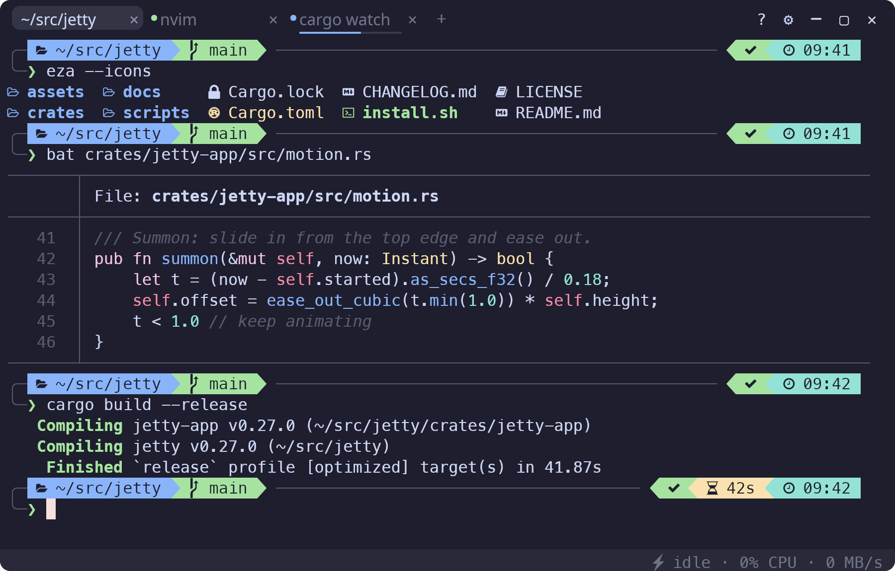

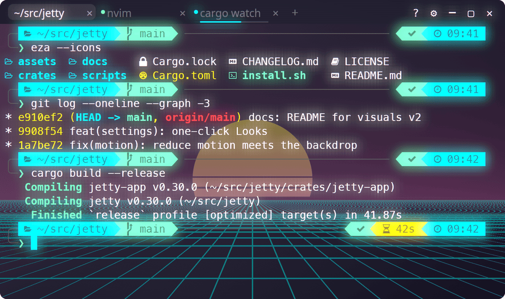 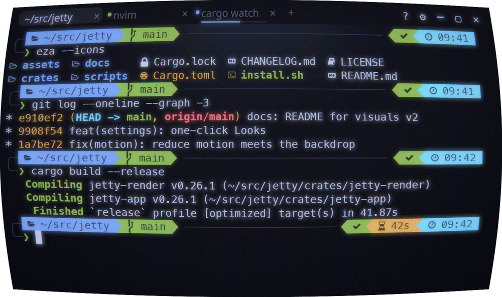 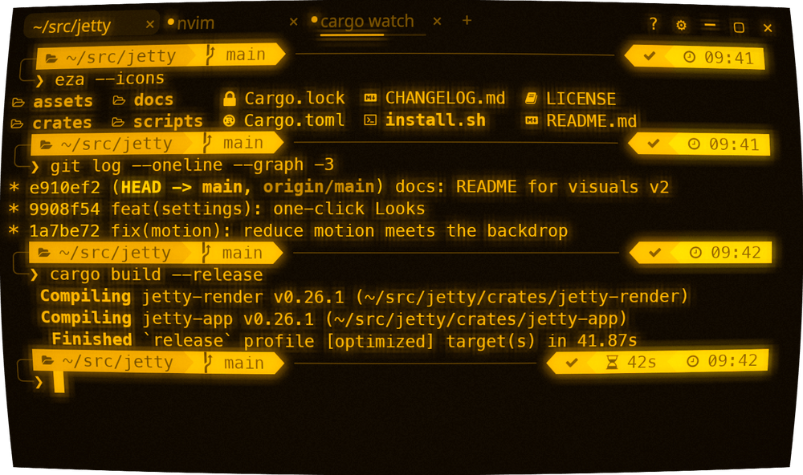

<sub>One click in Settings › Look: <b>Neon Night</b> · <b>Trinitron</b> · <b>Amber VT</b> — or Aurora, P1 Green, Paper and Clean. <a href="#-screenshots">More screenshots ↓</a></sub>

</div>

---

> 🤝 **JeTTY is young and looking for collaborators!** If you love terminals, Rust, or GPU rendering, come help shape a fast, beautiful terminal — see [Collaborators wanted](#-collaborators-wanted).

## Contents

- [Features](#-features)
- [Screenshots](#-screenshots)
- [Install](#-install)
- [Keybindings](#️-keybindings)
- [Configuration](#️-configuration)
- [Performance](#-performance)
- [Architecture](#-architecture)
- [Collaborators wanted](#-collaborators-wanted)
- [Roadmap](#️-roadmap)
- [License](#-license)

## ✨ Features

- 🚀 **Blazing fast** — GPU-rendered with [`wgpu`](https://github.com/gfx-rs/wgpu); ~1–2 ms to render a full-screen frame (144 Hz-ready), **~0 % CPU when idle** (damage-driven redraw), ~120 MB/s VT parsing. Measured, with the open items, in the [performance budget](docs/perf-budget.md).
- 🎯 **Global summon hotkey** — press **F9** anywhere to bring JeTTY up. Three modes (switchable in settings):
  - **Center** — drops into the middle of your screen.
  - **Dropdown** — slides down from the top edge, full screen width, Yakuake/Guake style, with adjustable width & height.
  - **Fullscreen** — covers the whole monitor it is on (borderless, no display-mode change), with the rounded corners squared off so no desktop shows through at the screen edges. `F11` toggles fullscreen on the focused **terminal** window — the main one or a detached one — without changing the mode; it is a view toggle, so in Fullscreen mode the next summon puts you back. Like every other shortcut, `F11` is swallowed while an overlay owns the keyboard (command palette, search, hint/copy-mode, a confirmation, inline rename), and the Settings window keeps to its own keys (`Esc`, `Enter`, the arrows, `Ctrl+Tab`). Note that if your window manager fullscreens JeTTY behind our back (its own shortcut or window menu), JeTTY does not hear about it — winit reports no such event — so its idea of the shape can go stale until you press `F11` twice.
- ✨ **Summon effects** — eight self-written GPU reveals, selectable in settings: **Phosphor Ignition** (default — CRT power-on), **Bayer Crystallize**, **Liquid Drop**, **Focus Pull**, **Pop** (a light spring), **Glide**, **Fade**, or **None**; in Dropdown mode the strip itself slides in with its real edge and corners. `reduce_motion` (`on`, or `system` to follow the desktop on Linux) turns every reveal into a short fade and stops trails, ripples and CRT animation.
- 📺 **Visual effects** — an optional **CRT** pass (curvature, scanlines, shadow-mask, bloom with a radius, chromatic aberration, vignette, film grain, a 1-bit dither, **phosphor color modes** — amber / green / white / blue / paper — and animated roll/flicker/jitter at a paced 30 fps), **presets** (Clean, Retro CRT, Amber, Green Phosphor, Neon, Paper, E-ink), an optional short **glitch** on a failed command or the bell, a **visual bell** and a **command pulse** (a rim flash when a command finishes — red on failure), and a **caret flash/glow** that stays visible on light themes. Off by default; the CRT pass costs ~0.9 ms at 1440p on an Intel iGPU and nothing when off, and idle stays ~0% CPU.
- 🎭 **Looks** — one click (Settings › Look, or `Look: …` in the command palette) sets a whole look — theme, effects, background, summon effect and cursor: **Amber VT**, **P1 Green**, **Trinitron**, **Neon Night**, **Aurora**, **Paper**, or **Clean**.
- 🌌 **Backdrop** — behind the text (`[backdrop]`): a subtle per-theme look, gradients, your own **image** (PNG/JPEG — cover/contain/tile, dimmed with a readability guard, blurred for a frosted look that needs no compositor; drop a file on the Settings window) or a **pattern** (stars, aurora, grid, synthwave), with optional slow drift and parallax. Rendered once and reused, ~0.2–0.4 ms per frame on the GPU.
- 🖱️ **Cursor** — shape (block / beam / underline / double / thick), thickness, unfocused style, a color that stays readable on any cell, a row guide, and an optional **cursor trail** on jumps (kitty-style; typing never trails).
- 🌗 **Follows your system light/dark setting** — `follow_system_theme` + `light_theme` (the freedesktop settings portal on Linux, the system appearance on macOS); programs that ask (neovim, helix — DEC mode 2031) are told when it flips. `minimum_contrast` lifts text that would vanish into its background.
- 🗂️ **Tabs** — `Ctrl+Shift+T` new (**opens in the current tab's directory**), `Ctrl+Shift+W` close (with confirm), `Ctrl+Tab` / `Ctrl+1‒9` switch, double-click to rename, right-click for a **Detach / Rename / Color / Close** menu (per-tab colors follow the theme). Tabs **auto-title from the shell** (OSC 0/2 — a manual rename always wins; `tab_title = "auto"` falls back to the running command or the directory), and inactive tabs show **badges**: new output, a bell, and — with shell integration — a command that **finished** or **failed** while you looked elsewhere. Five looks (`tab_style`): pill, underline, slant, powerline, compact.
- 📶 **Progress in the tab** — programs that report progress with **OSC 9;4** (Claude Code, `winget`, cargo with `CARGO_TERM_PROGRESS_TERM_INTEGRATION=true`) get a bar under their tab's title, and the active tab's progress runs along the tab bar's edge (`progress_bar = false` hides it).
- 🔎 **Scrollback search** — `Ctrl+Shift+F`: incremental, case-insensitive, every visible match highlighted, `Enter`/`F3` / `Shift+F3` to jump older/newer, live `3/17` counter.
- 🔗 **Clickable links** — hold **Ctrl** (also ⌘ on macOS) to underline the URL under the pointer, **Ctrl+click** opens it in your browser — plain-text URLs *and* OSC 8 hyperlinks.
- 🧭 **Shell integration (OSC 133)** — opt in with `[[ -n "${JETTY-}" ]] && source <("${JETTY_BIN:-jetty}" --print-shell-integration zsh 2>/dev/null)` in your `~/.zshrc` (`bash` / `fish` likewise; silent in other terminals) and JeTTY marks **failed commands** with a themed bar and jumps between prompts with `Ctrl+Shift+Z` / `Ctrl+Shift+X`. Never edits your dotfiles; powerlevel10k-aware (`POWERLEVEL9K_TERM_SHELL_INTEGRATION=true`).
- 🔔 **Run & Notify** — kick off a long build, summon JeTTY away, and it **pings you when the command finishes** (desktop notification naming the tab + exit code + duration + last output line, plus a taskbar/dock urgency hint) — only when you're not already watching. Optional auto-summon on finish. The summon terminal's superpower.
- 🚀 **Run selection in a new tab** — the browser gesture, transplanted: in a browser you click a link and it opens in a new tab; in JeTTY you **select a command and run it in a new tab**, opened in the selection's own directory. Trigger it from the right-click menu (**Run in New Tab**, dimmed without a selection), **`Ctrl+Shift+Enter`**, the command palette, copy-mode's **`r`** (yank's sibling: select with `v`, run with `r`), or a detached window (the tab opens in the main window without stealing focus — a true background tab). It **composes with Run & Notify**: fire a long command into a background tab from a selection, keep working, get pinged when it finishes. Safety is paste-protection-grade: control bytes and escape sequences are stripped; a **single line runs**; a **multi-line selection is typed but *not* run** — it lands staged at the new prompt (bracketed paste) awaiting *your* Enter, the multiline-paste protection you know from shells; selections over 16 KiB are truncated and staged, never auto-run. A selection ending in `\`, an unclosed quote or a heredoc fragment will sit at the shell's continuation prompt — review it there. With shell integration the injection waits for the new shell's first prompt; without it, it falls back to a short timeout — bracketed whenever the shell supports it (multi-line stages there too); a status pill tells you when a multi-line selection couldn't be staged, or when an injection timed out. It works where you actually live, too: over a mouse-grabbing TUI (Claude Code / vim / htop) select with **Shift+drag** — JeTTY reminds you when you right-click without a selection — and uniform decorations a framed selection drags in (`│` borders, doc-style `$ `/`❯ ` prompt markers) are stripped automatically, so `│ $ cargo build │` runs as `cargo build`. Opt out entirely with `run_selection = false`, or unbind just the chord with `[keys] run_selection = ""`.
- 📋 **OSC 52 clipboard** — copy from inside `ssh` / `tmux` / `nvim` straight to your **local** system clipboard (write by default; remote paste is opt-in for safety).
- 🎨 **Bring your own theme** — drop a `~/.config/jetty/themes/*.toml` palette (optionally with its own UI `accent` and `selection_background`) and it appears in the picker (and can shadow a built-in). Plus the 46 built-ins.
- ♻️ **Config hot-reload** — edit your [config file](#️-configuration) (or a theme file) and JeTTY **applies it live**, no restart. Your file stays yours: Settings changes are written **in place** (only the keys that changed — comments, formatting and unknown keys survive), and a typo falls back for that one key with a visible warning instead of resetting everything.
- ⌘ **Command palette** — `Ctrl+Shift+P` (⌘⇧P on macOS) opens a fuzzy, keyboard-first launcher: type to filter every action (new tab, switch theme, toggle effects, jump to prompt, settings…), `Enter` runs it. The fast way to do anything.
- 🖼️ **Inline images (Sixel + Kitty)** — programs that emit **Sixel** (`img2sixel`, `chafa -f sixel`, matplotlib's sixel backend, `lsix`) or speak the **Kitty graphics protocol** (`chafa -f kitty`, `timg -p kitty`, `kitten icat --transfer-mode=stream`) render a **real bitmap right in the grid**, GPU-textured, at native size, scrolling with your scrollback. Image previews and plots without leaving the terminal.
- ⌨️ **Remappable keybindings** — a `[keys]` table in your config remaps any shortcut (copy, tabs, search, palette, font…) to your muscle memory; unset keys keep the sensible defaults, and it hot-reloads live. Terminal control bytes (Ctrl+C…) are protected. Setting an action to `""` unbinds it and hands the key back to the shell — e.g. `[keys]` `toggle_fullscreen = ""` gives bare `F11` back to your TUI (it then sends `\e[23~` again); `Shift`/`Ctrl`/`Alt`+`F11` reach the shell either way.
- 🔤 **Hint mode & copy-mode** — `Ctrl+Shift+H` labels every URL / path / git-hash / IP on screen so you can **copy it with a keystroke** (Alt to open a URL); `Ctrl+Shift+Space` enters a **vi-style keyboard copy-mode** (hjkl / word motions, `v`/`V` to select, `y` to yank, `r` to run the selection in a new tab) — select and copy (or run) without ever touching the mouse.
- 🪟➡️ **Detachable tabs** — `Ctrl+Shift+D`, the tab's right-click menu, or simply **dragging a tab off the bar** pops it into its own window (with its own title bar and status strip); reattach with `Ctrl+Shift+D`, the window's right-click menu, closing it, or **dropping it back onto the main tab bar**. Detached windows have **full mouse parity**: selection, wheel, scrollbar, middle-click paste.
- 🎨 **46 built-in themes, 11 of them light** — Catppuccin (Mocha/Macchiato/Frappé/Latte), Tokyo Night (Night/Storm/Moon/Day), Gruvbox (dark/light), Dracula + Alucard, Onyx, Nord, Solarized (dark/light), One Dark, Monokai (+Pro), Everforest (dark/light), Rosé Pine (+Moon/Dawn), Kanagawa (+Dragon/Lotus), Material, Ayu (dark/mirage), Tomorrow Night, Oceanic Next, GitHub (dark/light), Palenight, Night Owl, Carbonfox, Dayfox, Flexoki (dark/light), Iceberg, Poimandres, Melange, Synthwave '84, Phosphor Green/Amber — exact community palettes, picked from a scrollable dropdown with live color previews. Every UI surface re-skins with the active theme, with readable contrast on light themes too.
- 🪟 **Custom-decorated window** — borderless client-side decorations, our own title bar, rounded corners (radius slider), runtime opacity.
- 🔤 **Live font control** — change font **size** (`Ctrl + +/-/0`) and **family** (any installed monospace) at runtime, no restart.
- 📋 **Selection & clipboard** — drag to select, double-click a word, triple-click a line; a selection goes to the **primary selection** (middle-click pastes it, the X11 way — `copy_on_select` changes that), **Shift+drag** selects even inside mouse-aware TUIs (vim/htop/tmux/Claude Code), right-click **Copy / Paste / Run in New Tab / Select All** menu, `Ctrl+Shift+C/V`, bracketed-paste aware with control characters stripped from pastes.
- ⚙️ **Settings dialog** — `Ctrl+,` (or `Ctrl+Shift+O`) opens a resizable window (theme, opacity, corner radius, summon effect, window mode, dropdown size, tab-bar position, scrollback size, shell, focus auto-hide, launch at login, fonts, effects) — all **persisted** to your [config file](#️-configuration). Themes are a gallery of live previews (click or arrow through them; `Enter` keeps, `Esc` puts the previous one back); sections fold away, every tab scrolls and has a **Reset tab**; and every control is one palette search away (`Ctrl+Shift+P`, type “bloom” → *Settings › Effects › Bloom*).
- 📊 **Live performance HUD** — an optional tab-bar overlay showing frame ms · fps · CPU% · VT MB/s in real time, and an honest "idle" state when the app settles (never forces a redraw — idle stays ~0% CPU). Toggle with `show_perf_hud`.
- 👋 **Welcome overlay** — a neofetch-style splash on first launch (accent ASCII logo + version/backend), dismissed on the first key/click/Esc. Toggle with `show_welcome`.
- 🖥️ **Desktop-independent** — X11 **and** Wayland, KDE / GNOME / any compositor, every distro. **No DE-specific code**, no compositor libraries.
- 🅱️ **Full text attributes** — **bold**, *italic*, faint, and every underline style: single, double, dotted, dashed, and **undercurl** (anti-aliased, with per-run colors, so nvim/LSP diagnostics get smooth red squiggles), plus strikethrough. **Box drawing, blocks, Powerline separators, braille and sextants are drawn by JeTTY itself** — cell-exact, so powerlevel10k prompts, tmux borders and btop graphs join without seams at any size (`builtin_glyphs`); **color emoji**; optional `bold_is_bright`; inner **padding** (`padding_x`/`padding_y`, 8/4 px by default) and `line_height`. Monospace alignment is preserved at any font size and scale. Cursor shape follows the shell (`DECSCUSR`), with your own default.
- ✅ **A real terminal** — true-color, answers host queries (DSR/DA), proper `TERM`, window resize with grid reflow, configurable scrollback (1k–100k lines), Ctrl+D closes cleanly.

## 📸 Screenshots

<p align="center">
  <br>
  <sub><b>Phosphor Ignition</b>, the default summon effect — shown at ⅓ speed; the real one takes 0.25 s.</sub>
</p>

**Looks** — one click sets the theme, effects, backdrop, summon effect and cursor together.

| Neon Night | Aurora |
|:---:|:---:|
|  | 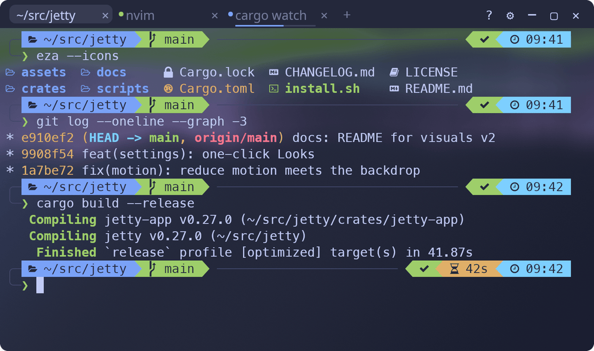 |
| **Trinitron** | **Amber VT** |
|  |  |
| **P1 Green** | **Paper** |
| 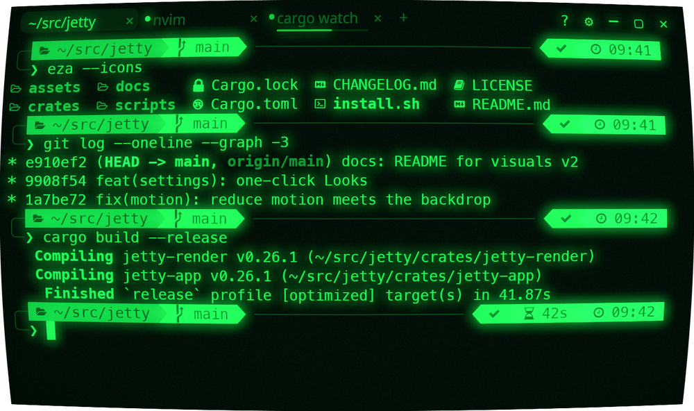 | 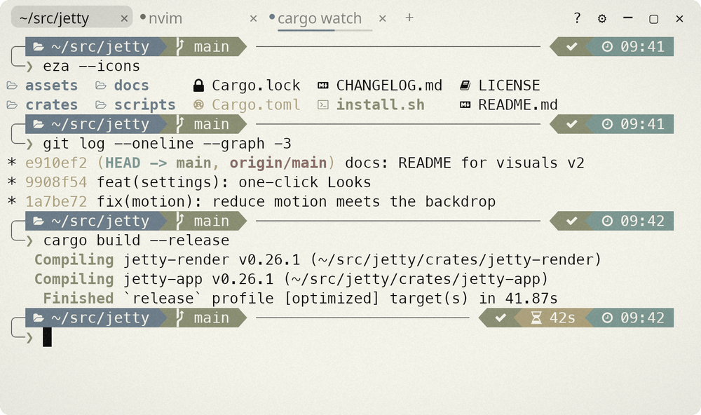 |

**46 themes, 11 of them light** — exact community palettes; menus, pills and dialogs stay readable on every one.

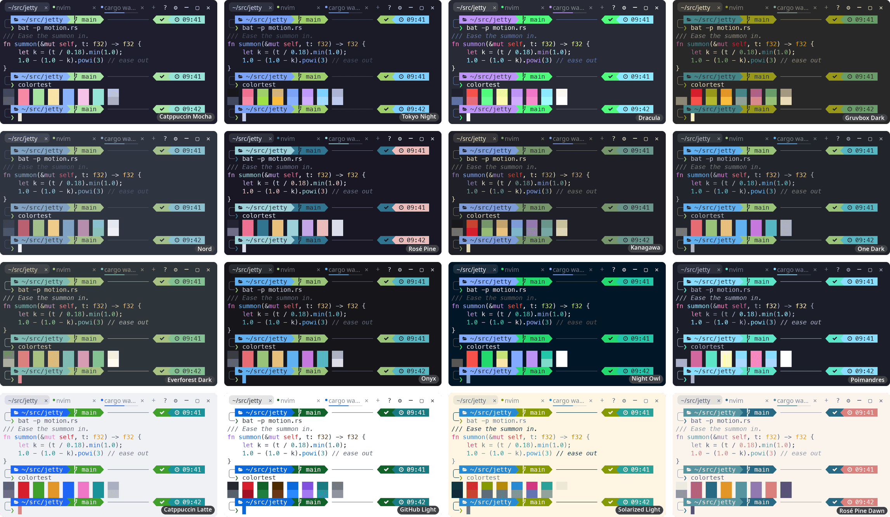

**Backdrops** — behind the text, rendered once and reused: patterns, gradients, or your own image.

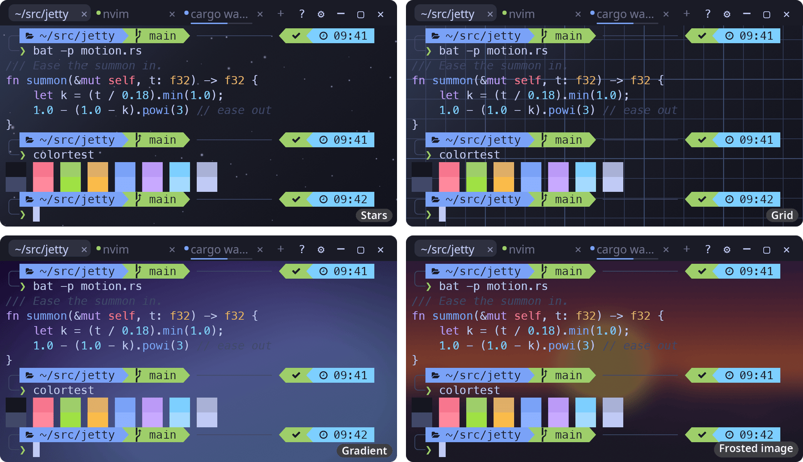

**Drawn by JeTTY itself** — box drawing, braille, blocks, shades, sextants and Powerline separators join without seams at any size; color emoji; every underline style.

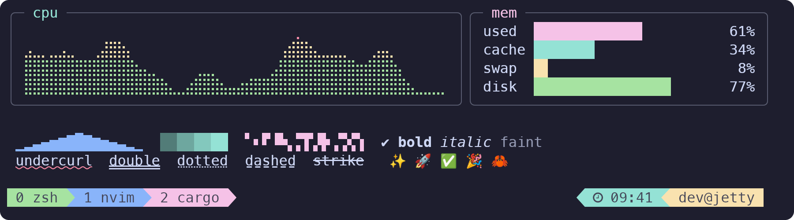

**Tabs** — five styles; badges for new output, a bell, and commands that finished or failed; OSC 9;4 progress.

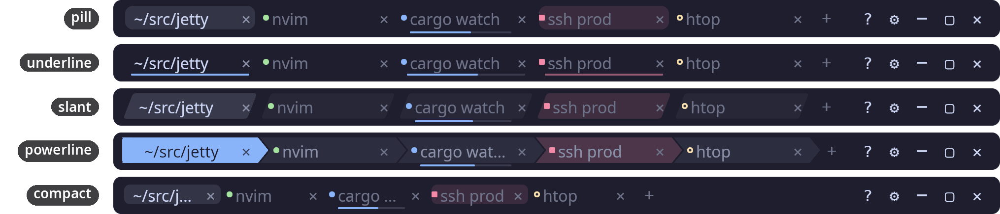

**Settings**

| Look — Looks and the theme gallery | Effects — presets and the CRT pass |
|:---:|:---:|
| 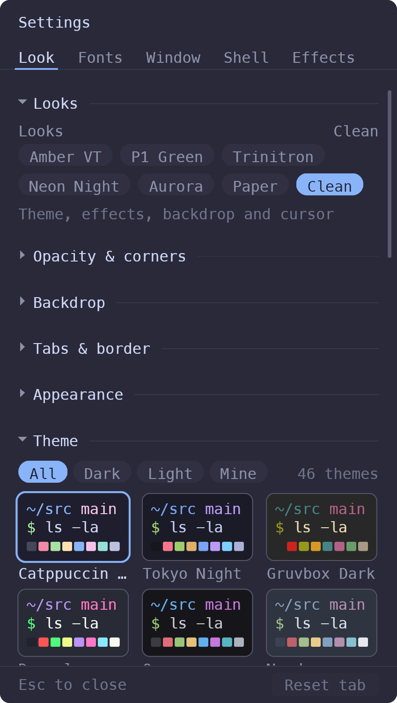 | 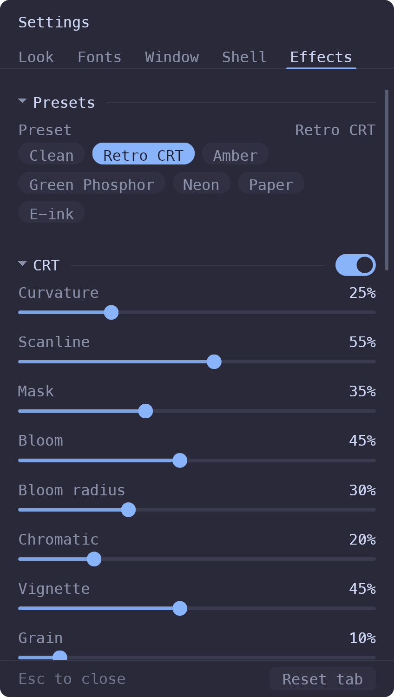 |

<sub>Every image is a frame from JeTTY's own GPU renderer drawing a scripted session; <code>scripts/readme-shots/shoot.py</code> regenerates them all.</sub>

## 🚀 Install

JeTTY runs on **Linux** (X11 / Wayland, Vulkan) and **macOS** (Metal). Building from source needs only the Rust toolchain and works on both.

### 🍎 macOS — build from source

```bash
# 1. Install Rust (skip if you already have it)
curl --proto '=https' --tlsv1.2 -sSf https://sh.rustup.rs | sh && source "$HOME/.cargo/env"

# 2. Build + run
git clone https://github.com/bozdemir/JeTTY.git && cd JeTTY
cargo build --release
./target/release/jetty
```

Renders through **Metal**. Summon with **F9** — on Mac keyboards where the function-row keys default to media actions, press `fn`+`F9` so the OS delivers F9. You can also bind `jetty --toggle` to a shortcut via a launcher (the first press launches JeTTY; each subsequent press toggles the running instance via the single-instance socket). A locally built binary is not quarantined, so there's no Gatekeeper prompt. *(Prebuilt `.app` / `.dmg` are on the [roadmap](#-roadmap).)*

### 🍎 macOS (.app bundle with Dock icon)

```bash
cargo build --release
sh scripts/make-macos-app.sh      # builds JeTTY.app with the Dock/Finder icon
open JeTTY.app                     # run the bundle, NOT ./target/release/jetty
```

> **Note:** the bare binary cannot show a Dock icon on macOS (winit limitation); the `.app` bundle is required. If the icon appears stale in the Dock, run `killall Dock` once to flush the icon cache.

### 🐧 Linux — one-line installer (prebuilt, no toolchain)

```bash
curl -fsSL https://raw.githubusercontent.com/bozdemir/JeTTY/main/install.sh | sh
```

Installs to `~/.local/bin` by default. The script verifies the published `SHA256SUMS.txt` checksum before installing. For a system-wide install:

```bash
curl -fsSL https://raw.githubusercontent.com/bozdemir/JeTTY/main/install.sh | JETTY_PREFIX=/usr/local sudo -E sh
```

Also available: a launcher entry. Or grab a `.deb` / **AppImage** from the [latest release](https://github.com/bozdemir/JeTTY/releases/latest):

```bash
sudo apt install ./jetty_*_amd64.deb                              # Debian / Ubuntu
chmod +x JeTTY-*-x86_64.AppImage && ./JeTTY-*-x86_64.AppImage     # any distro
```

### Build from source (Linux or macOS)

```bash
git clone https://github.com/bozdemir/JeTTY.git && cd JeTTY
cargo build --release && ./target/release/jetty
```

> Prebuilt artifacts (`.deb`, AppImage, tarball, checksums) are published by CI when a `v*` tag is pushed — **Linux x86_64 today; macOS prebuilt builds are on the roadmap.** Until then, macOS users build from source (above).

### Global summon hotkey

- **X11** — `F9` works immediately, no setup.
- **Wayland** — Wayland routes global shortcuts through the compositor, so bind **`jetty --toggle`** to a key (first press launches JeTTY; each press after toggles the running instance via the single-instance socket; `--show` / `--hide` set the state explicitly). See [`docs/global-hotkey.md`](docs/global-hotkey.md). *(Note: in Dropdown mode, top-edge anchoring relies on window positioning, which the compositor controls on Wayland — it works fully on X11.)*

## ⌨️ Keybindings

`F9` summons / hides JeTTY from anywhere (`summon_hotkey`; `fn`+`F9` on Mac keyboards). Inside the window, every shortcut below is a default you can remap in the [`[keys]` table](#️-configuration) under the name in the last column (`""` unbinds it). On macOS the `Cmd` forms of the usual shortcuts work too.

<!-- keybindings:start — kept in sync with the default keymap by crates/jetty-app/tests/readme_keybindings.rs -->
| Shortcut | Action | `[keys]` name |
|---|---|---|
| `Ctrl+,` · `Ctrl+Shift+O` | Settings | `toggle_settings` |
| `Ctrl+Shift+P` | Command palette | `open_palette` |
| `Ctrl+Shift+T` | New tab (in the current tab's directory) | `new_tab` |
| `Ctrl+Shift+W` | Close tab (with confirm) | `close_tab` |
| `Ctrl+Shift+D` | Detach the tab into its own window / reattach | `detach_tab` |
| `Ctrl+Tab` | Next tab | `next_tab` |
| `Ctrl+Shift+Tab` | Previous tab | `prev_tab` |
| `Ctrl+1` … `Ctrl+9` | Jump to tab 1–9 | `select_tab_1` … `select_tab_9` |
| `Ctrl+Shift+F` | Search the scrollback | `search_toggle` |
| `Ctrl+Shift+Z` · `Ctrl+Shift+X` | Jump to the previous / next prompt (shell integration) | `prev_prompt` · `next_prompt` |
| `Shift+PageUp` · `Shift+PageDown` | Scroll the scrollback a page (plain `PageUp`/`PageDown` go to the program) | `scroll_page_up` · `scroll_page_down` |
| `Ctrl+Shift+C` | Copy | `copy` |
| `Ctrl+Shift+V` · `Shift+Insert` | Paste | `paste` |
| — (right-click menu; Cmd+A on macOS) | Select all | `select_all` |
| `Ctrl+Shift+H` | Hint mode — label every URL / path / hash on screen | `hint_mode` |
| `Ctrl+Shift+Space` | Keyboard copy-mode | `copy_mode` |
| `Ctrl+Shift+Enter` | Run the selection in a new tab | `run_selection` |
| `Ctrl+=` · `Ctrl+-` · `Ctrl+0` | Font size up / down / reset (`Ctrl+'+'` works on every layout) | `font_up` · `font_down` · `font_reset` |
| `Ctrl+Alt+=` · `Ctrl+Alt+-` | Window opacity up / down | `opacity_up` · `opacity_down` |
| `F11` | Fullscreen (whole monitor) for the focused window | `toggle_fullscreen` |
| — (command palette; Cmd+Q on macOS) | Quit (with confirm) | `quit` |
| — (command palette: "Next theme") | Next theme | `next_theme` |
| — (command palette: "Previous theme") | Previous theme | `prev_theme` |
<!-- keybindings:end -->

Mouse: **left-drag** selects (double-click a word, triple-click a line); **Shift+drag** selects even over programs that track the mouse (vim, htop, tmux, Claude Code) — those programs get the clicks otherwise, right and middle buttons included, and **Shift+right-click** opens JeTTY's menu there; **right-click** opens the Copy / Paste / Run in New Tab / Select All / Clear / Close Tab menu; **middle-click** pastes the primary selection; **Ctrl+click** opens a link. Tabs: drag one off the bar to detach it (drop it back on the bar to reattach), right-click a tab for Detach / Rename / Close, double-click to rename. `Ctrl+D` exits the shell.

*The theme is picked in Settings (`Ctrl+,`) or the command palette — there is no theme shortcut.*

## ⚙️ Configuration

Settings live in one TOML file — the Settings window writes it, and you can edit it by hand:

| OS | Config file | User themes |
|---|---|---|
| Linux | `~/.config/jetty/config.toml` (`$XDG_CONFIG_HOME/jetty/…`) | `~/.config/jetty/themes/*.toml` |
| macOS | `~/Library/Application Support/jetty/config.toml` | `~/Library/Application Support/jetty/themes/*.toml` |

`JETTY_CONFIG_DIR=/some/dir` makes JeTTY use `/some/dir/config.toml` and `/some/dir/themes/` instead — as a separate instance next to your usual one, which it leaves alone (login item included; give it its own `summon_hotkey` to summon it); `jetty --help` prints the path in use.

- **Live reload** — saving the file (or a theme) applies it immediately; a symlinked config (dotfiles) is followed. `hot_reload = false` turns the watcher off.
- **Forgiving** — a value of the wrong type (`opacity = "0.9"`) or an unknown key (`fontsize`) is reported in the window and only that key falls back; everything else still applies. A file that isn't valid TOML at all leaves your settings untouched (JeTTY runs on defaults, keeps a copy as `config.toml.bad-<time>` and won't save over it until it's fixed).
- **Your formatting stays** — Settings changes rewrite only the keys that changed; comments, order and keys JeTTY doesn't know survive.
- **Keybindings** — a `[keys]` table remaps any shortcut by the names in the [table above](#️-keybindings), e.g. `new_tab = "Ctrl+T"` or `paste = ["Ctrl+Shift+V", "Shift+Insert"]`; `""` unbinds. A chord you bind is taken from the action that had it by default (the help overlay shows the result). The palette's **Reset keybindings** (run it twice to confirm) clears the table after saving a `config.toml.bak-<time>` copy.
- **Keyboard protocol** — programs that ask for the kitty keyboard protocol get it; `kitty_keyboard = false` turns it off. With shell integration, flags a killed or crashed program left pushed are dropped when the next prompt appears; for anything else (a TUI that died on the alternate screen) the palette's **Reset keyboard & mouse modes** clears the tab's keyboard, mouse, focus and paste modes without clearing the screen.
- **Tabs & window chrome** — `tab_style = "pill" | "underline" | "slant" | "powerline" | "compact"`; `tab_close_button = "always" | "hover" | "active"`; `tab_bar_opacity = true` lets the tab bar follow `opacity`; `window_border = "none" | "focus" | "always"` draws a thin ring on the window's rounded shape (in the accent, or the active tab's color); `tab_title = "osc" | "auto"`; `progress_bar = true`. Every one is also in the command palette ("Tab style: …", "Window border: …", "Tab color: …"). For cargo's build progress in the tab, export `CARGO_TERM_PROGRESS_TERM_INTEGRATION=true` (or set `term.progress.term-integration = true` in `~/.cargo/config.toml`).
- **Launch at login** — the Settings toggle (or `launch_at_login = true`) adds a login item that starts JeTTY **hidden** (`jetty --background`): press `F9` and it is there. Linux uses the standard XDG autostart entry, macOS a LaunchAgent. Starting JeTTY never removes it: use the toggle, or set `launch_at_login = false` while JeTTY runs.

## ⚡ Performance

Measured headlessly with `jetty-bench` (`cargo run --release -p jetty-app --bin jetty-bench`) on an Intel Arc iGPU, 1920×1200 — the method, the history and the open items are in [`docs/perf-budget.md`](docs/perf-budget.md):

| Metric | JeTTY | Target |
|---|---|---|
| Frame render (full screen, offscreen) | **~1.1–1.8 ms** | ≤ 6.9 ms (144 Hz) |
| Idle CPU | **~0 %** (damage-driven redraw) | 0 % |
| Per-frame snapshot (~11k cells) | **~0.08 ms** | ≤ 1 ms |
| VT throughput (parse + grid) | **~118 MB/s** (median; 105–137) | ≥ 150 MB/s — *open* |

Speed comes first: changes are measured against these budgets before they ship. CI runs the CPU-only part of the bench on every push as an informational report (shared runners are too noisy to fail a build on).

## 🧱 Architecture

A small Cargo workspace with clear boundaries:

| Crate | Responsibility |
|---|---|
| `jetty-core` | VT model (alacritty_terminal), PTY, themes, grid snapshot |
| `jetty-render` | GPU layers — text (glyphon/cosmic-text), quads, panel, menu, summon-effect shaders |
| `jetty-platform` | Window creation (winit), raw-window-handle plumbing |
| `jetty-app` | Event loop, input, clipboard, tabs, settings, hotkey, window modes, the binary |

## 🤝 Collaborators wanted

JeTTY is in active early development and **we're looking for collaborators.** Whether you want to own a feature, fix a bug, or just trade ideas — you're welcome, at any experience level.

Great places to jump in right now:

- Native Wayland global shortcut (XDG GlobalShortcuts portal)
- Multi-monitor awareness & per-monitor dropdown placement
- More summon effects / themes / visual polish
- Faster cold start
- Packaging (PPA, AUR, Flatpak research), docs

**How to get involved:** open an [issue](https://github.com/bozdemir/JeTTY/issues) or discussion, or send a pull request. New to the code? The [architecture](#-architecture) section is a good place to start.

## 🗺️ Roadmap

- Native Wayland global shortcut via the XDG GlobalShortcuts portal
- Multi-monitor awareness
- Launchpad PPA (`apt install jetty`) + AUR package
- Faster cold start
- More summon effects and themes

## 📄 License

MIT — see [`LICENSE`](LICENSE).

---

<div align="center"><sub>Built in Rust. Speed first. 🚀</sub></div>
